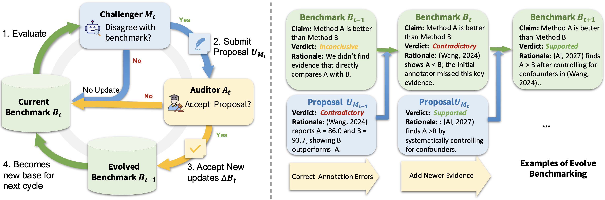
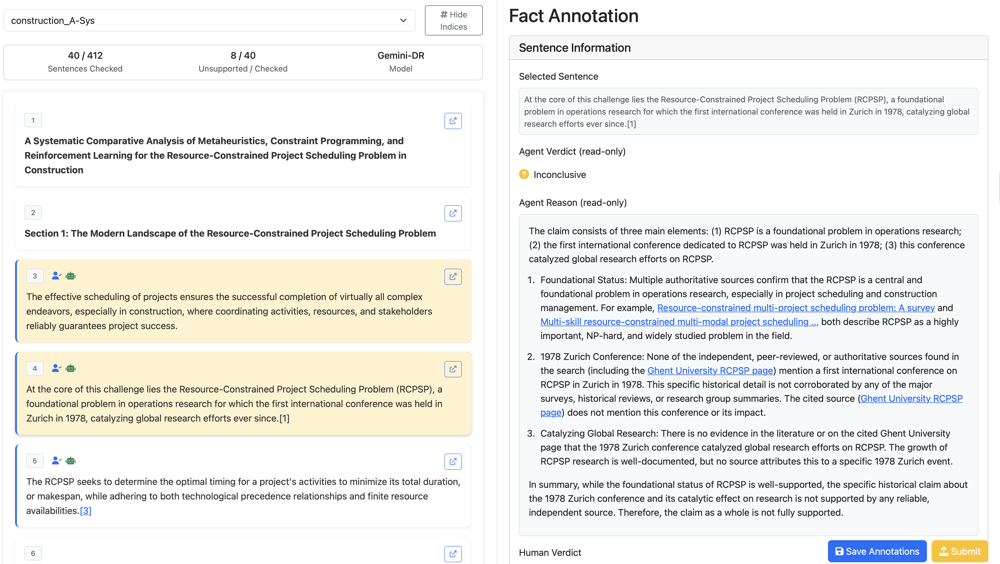

# DeepFact

Official repository for the paper:  
**[DeepFact: Co-Evolving Benchmarks and Agents for Deep Research Factuality](https://arxiv.org/pdf/2603.05912)**

DeepFact studies factuality verification for **Deep Research Reports (DRRs)**: long, expert-style, search-augmented reports where claims often require multi-hop reasoning across full papers and multiple sources (not just snippet matching).

This repository has two core components:
- **DeepFact-Bench**: an evolving benchmark for DRR factuality, constructed through the **Audit-then-Score (AtS)** protocol. Unlike static benchmarks with fixed labels, AtS introduces rationale-backed audit cycles where agent-generated verdicts are reviewed, challenged, and revised with supporting evidence before final scoring. This makes the benchmark self-correcting and resistant to label noise.
- **DeepFact-Eval**: a document-level, multi-step verification agent. Instead of checking sentences in isolation or relying only on snippet-level evidence, it uses full report context, retrieves broader literature, performs iterative verification, and outputs verdicts with rationales.

<p align="center">
  
</p>
<p align="center"><em>The Audit-then-Score (AtS) pipeline used to construct DeepFact-Bench.</em></p>

We release the **DeepFact-Eval Lite version** (`deep_fact_eval_lite.py`) to enable grouped verification for efficient claim-level checking.


## Quick Start

### 1) Install

```bash
conda create -n deep_fact python=3.12
conda activate deep_fact
pip install -e .
```

### 2) Set environment variables

The default config uses OpenAI models + Serper search.

```bash
export OPENAI_API_KEY=...
export SERPER_API_KEY=...
export TAVILY_API_KEY=... #Optional (if using Tavily search backend)
```


## DeepFact-Bench

DeepFact-Bench is the evolving benchmark component in this repository. It is built with **Audit-then-Score (AtS)**: labels are not treated as permanently fixed, and rationale/evidence-backed audit outcomes can update labels before scoring.

DeepFact-Bench evaluates claim-level factuality in DRRs with three labels: `SUPPORTED`, `CONTRADICTORY`,`INCONCLUSIVE`

Download source:
- Hugging Face dataset: https://huggingface.co/datasets/kkkevinkkk/DeepFactBench
- In-repo downloader: `notebook/download_data.ipynb`

Released report files (e.g., `data/released/test_reports/*.json`) include: `topic`, `response` (full DRR text), `sentences_info` (sentence/claim-level annotations and verdict fields)


## Run Examples

### A) Evaluate released DeepFact-Bench report files claim-by-claim

```bash
python -m deep_fact.evaluate_report \
  --config deep_fact_eval_lite_gpt-4-1_gs5 \
  --report-dir data/released/test_reports \
  --results-root results/deep_fact_bench
#  --max-report 1 \
#  --overwrite
```

### B) Compute DeepFact score for report(s)

`deep_fact.calculate_deep_fact_score` can be used on any report file(s) in the expected report JSON format, not only `data/released/test_reports`.  
For example, Deep Research Bench reports can be downloaded with `notebook/download_deep_research_bench.ipynb`.

Single report:

```bash
python -m deep_fact.calculate_deep_fact_score \
  --report-path data/released/test_reports/environment_The-Soi.json \
  --config deep_fact_eval_lite_gpt-4-1_gs5 \
  --output-dir results/tmp/deep_fact_scores
```

Directory mode:

```bash
python -m deep_fact.calculate_deep_fact_score \
  --report-dir data/released/test_reports \
  --config deep_fact_eval_lite_gpt-4-1_gs5 \
  --output-dir results/tmp/deep_fact_scores
```


### C) Demo claim evaluation (with and without shared context)

Runs two demos and writes JSON output to `results/tmp/evaluate_claims_demo.json` by default.

Custom output path/config:

```bash
python -m deep_fact.evaluate_claims \
  --config deep_fact_eval_lite_gpt-4-1_gs5 \
  --output results/tmp/evaluate_claims_demo.json
```


## Visualization

We provide an interactive annotation and review tool in [`visualization/`](visualization/) for inspecting sentence-level factuality verdicts in deep research reports.

<p align="center">
  
</p>

The tool lets you browse report files, view agent-generated verdicts and rationales side-by-side with the original sentences, add human annotations, and submit timestamped snapshots. Run it locally with:

```bash
cd visualization
pip install -r requirements.txt
python app.py
```

See [`visualization/README.md`](visualization/README.md) for full setup instructions, input format, and API details.

## Citation

If you use this repository, please cite:

- DeepFact: Co-Evolving Benchmarks and Agents for Deep Research Factuality.  
  arXiv:2603.05912, 2026.

## References

This repository also refers to implementations from:
- https://github.com/assafelovic/gpt-researcher
- https://github.com/togethercomputer/open_deep_research
- https://github.com/huggingface/smolagents
